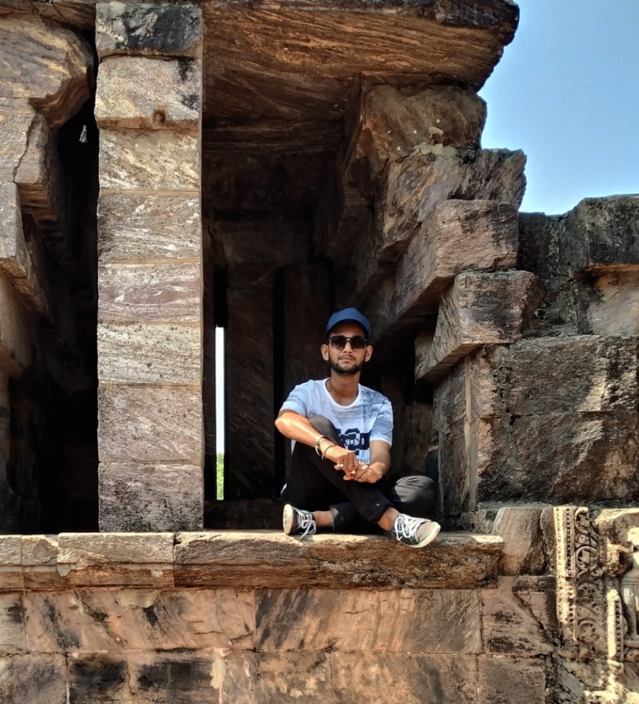

# Shubham Verma
  
  
  
  
  
  
  
  ### Pronouns - He/Him/His
  
  
  I am fresher and completed by degree in **Electrical Engineering**:mortar_board:. I am into problem solving, backend Development. I also have my hands on technologies like Front-end and Machine Learning. I am currently learning Backend Development and Cloud. Feel free to reach out to me on LinkedIn (super active there)!
  
  ### :1st_place_medal: Some of my acheivements:
  
  * 5 ⭐ at <a href = "https://www.hackerrank.com/shubhamverma2604" target="_blank">HackerRank</a>
  * 500+ Questions on <a href = "https://leetcode.com/shubhamverma2604/" target="_blank">Leetcode</a>.
  * Secured 1st place in College's Final Year Project.
 
  
  #### 👨🏻‍💻 Languages and Tools:  
  <code></code>
  <code></code>
  <code></code>

 
  <code></code>
  <code></code>
  <code></code>
  <code></code>
  <code></code>
  <code></code>
  <code></code>

  
  &nbsp; &nbsp; &nbsp; &nbsp; &nbsp; &nbsp; &nbsp; &nbsp; &nbsp; &nbsp; 
  
  
  
  

 If you find my work good, consider giving it a ⭐ to show some ❤️!
